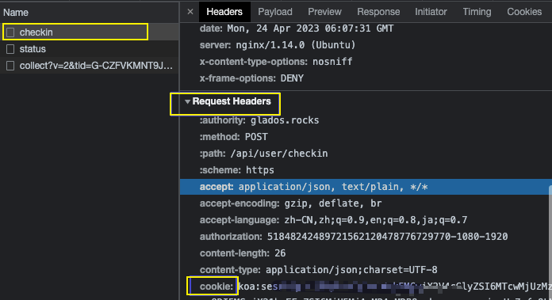
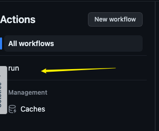
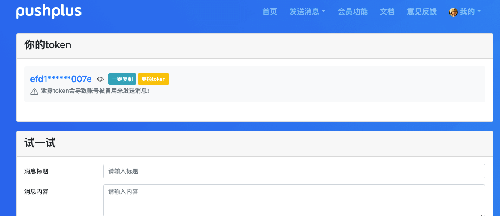

# Checkin

GitHub Actions 实现 [GLaDOS][glados] 自动签到

([GLaDOS][glados] 可用邀请码: `JTN8P-XXXG8-HC396-O92AS`, 双方都有奖励天数)

## 使用说明

1. 先Fork 这个仓库

1. 登录 [GLaDOS][glados] 获取 Cookie

1. 添加 Cookie 到 Secret `GLADOS`

    >到仓库里`Settings=>secrets and variables>actions>` 点击 按钮 `New repository secret`创建`Repository secrets` ,`name`是参数值`GLADOS`，`secret`是请求的`glados`请求 `cookie`。cookie获取在glados网站里点击签到时
    >同理若是需要推送使用
    >
    >获取cookie方式
    >
    >进入控制台模式，点击签到时，捕获checkin接口的请求头将cookie都复制出来，即可获取到cookie值
    >
    >

1. 启用 Actions, 每天北京时间 00:10 自动签到

    点击 Actions, 再点击下方 `I understand the workflows...` 绿色按钮同意使用 Github Actions.

    在左侧能看到run

    

    点击再点击右侧enable的按钮即可。

1. 如需推送通知, 可用 [PushPlus][pushplus], 添加 Token 到 Secret `NOTIFY`
    >   点击链接注册获取token <https://www.pushplus.plus/push1.html>，就像配置cookie一样配置到仓库设置里
    >
    >   

## 如何注册

1. 直接点击通过 [点击Glados](https://glados.space/landing/JTN8P-XXXG8-HC396-O92AS) 或者[点击备用链接](https://jtn8p-xxxg8-hc396-o92as.glados.space) 注册

2. 若1无法打开，直接注册GLaDOS(注册地址在 <https://github.com/glados-network/GLaDOS> 实时更新)
成功后输入邀请码:`JTN8P-XXXG8-HC396-O92AS` 激活, 自动填写激活

[glados]: https://github.com/glados-network/GLaDOS
[pushplus]: https://www.pushplus.plus/
